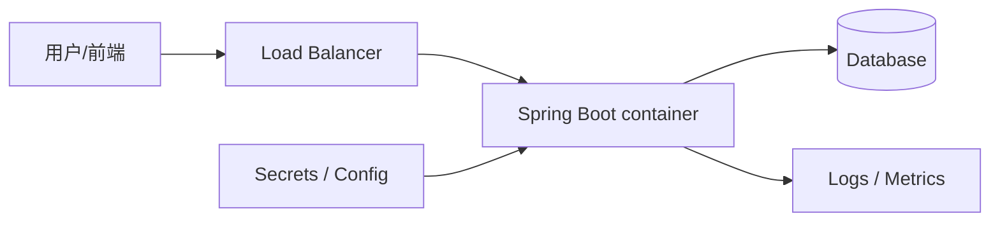

# Phase 1 · AWS Production

## Week 1 — Baseline → deployable service

这周的目标不是再背一张 AWS 服务清单，而是把一个 Spring Boot 服务准备成可以交给平台运行的 workload。

### 本周完成标准

- 服务有明确的 liveness/readiness health endpoint，并能返回 HTTP 200。
- 配置从环境变量注入；代码和 Docker image 中不出现 secret。
- 可以稳定构建同一个 Docker image，并记录 image size、启动时间和健康检查结果。
- 有一页 README，画出当前请求链路，并写下失败时的恢复动作。
- 若 AWS account 已准备好：用单独的 `dev` 命名空间/资源做一次可销毁部署；完成后删除资源。

## 今天的学习目标（60–90 分钟）

### 1. 先建立 production mental model



你今天要能用自己的话回答：

1. 为什么 load balancer 不能只检查 TCP port，而要检查应用 health endpoint？
2. liveness 和 readiness 分别回答什么问题？
3. 哪些配置可以进 image，哪些必须在运行时注入？

### 2. 建立本地 baseline

在你的 Spring Boot 项目根目录执行（Maven/Gradle 选择自己正在使用的命令）：

```bash
# 构建并启动项目，然后在另一个终端检查健康状态
./mvnw spring-boot:run
# 或
./gradlew bootRun

curl -i http://localhost:8080/actuator/health
```

如果还没有 Actuator，在 `pom.xml` 加入 `spring-boot-starter-actuator`；再把下面配置放进 local profile：

```properties
management.endpoints.web.exposure.include=health,info
management.endpoint.health.probes.enabled=true
```

然后分别检查：

```bash
curl -i http://localhost:8080/actuator/health/liveness
curl -i http://localhost:8080/actuator/health/readiness
```

记录 5 次结果，填入 README：

| 指标 | 结果 |
|---|---|
| JDK / Spring Boot version |  |
| 启动到 readiness 的时间 |  |
| Docker image size |  |
| health endpoint status |  |
| 本地端口与 profile |  |

### 3. 验证 Docker workload

使用你现有的 Dockerfile；如果还没有，先按项目使用的 JDK 版本写一个 multi-stage Dockerfile。构建和运行：

```bash
docker build -t spring-api:week1 .
docker run --rm --name spring-api-week1 \
  -p 8080:8080 \
  -e SPRING_PROFILES_ACTIVE=local \
  spring-api:week1
```

另一个终端执行：

```bash
curl -fsS http://localhost:8080/actuator/health/readiness
docker image inspect spring-api:week1 --format '{{.Size}}'
docker logs spring-api-week1
```

停止容器：

```bash
docker stop spring-api-week1
```

## 本周节奏（8–10 小时）

| 天数 | 任务 | 时间 |
|---|---|---:|
| Day 1 | 建立 repo、health endpoint、baseline | 1.5h |
| Day 2 | 外部化配置，检查 secret 是否泄漏 | 1h |
| Day 3 | Docker image、非 root 用户、graceful shutdown | 2h |
| Day 4 | ECR repository 与 image push | 1.5h |
| Day 5 | ECS/Fargate `dev` 部署（可销毁） | 2h |
| Day 6 | CloudWatch logs、health failure、rollback 演练 | 1h |
| Day 7 | README、架构图、面试复盘 | 1h |

## 成本与安全护栏

- 所有资源统一使用 `career-lab-dev-*` 前缀和 tag：`Project=career-lab`, `Owner=<你的名字>`, `Env=dev`。
- 先设置 AWS Budget/费用告警；不要把 access key 写入代码或 Git。
- 没有完成实验时，不保留 ALB、NAT Gateway、RDS 等可能持续计费的资源。
- 今天只做本地 baseline；确认结果后再进入 AWS 部署。

## 今天的 checkpoint

完成后把以下 4 项贴回来，我会逐项 review 并进入 Day 2：

1. `curl` 的 health endpoint 输出（可隐藏敏感信息）。
2. baseline 表格中的 5 个结果。
3. `Dockerfile` 和 `docker build` 是否成功。
4. 你对 liveness/readiness 区别的两三句话解释。

